<p align="center">
  
</p>

<h1 align="center">cybersecurity-agent</h1>

<p align="center">
  <strong>AI-Powered Offensive & Defensive Security Platform</strong><br/>
  Autonomous penetration testing, vulnerability assessment, and threat intelligence — 200+ tools powered by Claude AI.
</p>

<p align="center">
  
  
  
  
  
  
  
</p>

<p align="center">
  Built by <strong>David Lopez</strong> | <a href="https://github.com/bboydaves-afk">GitHub</a>
</p>

---

## Overview

**cybersecurity-agent** is a comprehensive AI-driven security operations platform that automates the full penetration testing lifecycle — from reconnaissance and vulnerability discovery through exploitation and reporting. It integrates with industry-standard tools (Nmap, Metasploit, Shodan, VirusTotal, Burp Suite) and orchestrates them through Claude AI for intelligent, context-aware security assessments.

Designed for authorized penetration testing engagements, CTF competitions, security research, and defensive security operations.

---

## Architecture

```mermaid
graph TB
    subgraph Interfaces
        WEB[Web Dashboard<br/>FastAPI]
        CLI[CLI<br/>Typer]
        AI[AI Chat<br/>Claude AI]
    end

    subgraph Engines
        RECON[Recon Engine]
        VULN[Vulnerability Engine]
        WEBAPP[WebApp Engine]
        NET[Network Engine]
        CLOUD[Cloud Security Engine]
        OSINT[OSINT Engine]
        PASS[Password Engine]
        C2[C2 Engine]
        FORENSICS[Forensics Engine]
        WIRELESS[Wireless Engine]
        MOBILE[Mobile Engine]
        SOCIAL[Social Engineering]
        THREAT[Threat Intel Engine]
        API_SEC[API Security Engine]
        AD[Active Directory Engine]
        CONTAINER[Container Engine]
        EMAIL_SEC[Email Security Engine]
        SECRETS[Secrets Engine]
        COMPLIANCE[Compliance Engine]
        EVIDENCE[Evidence Engine]
        REPORTING[Reporting Engine]
        PLAYBOOK[Playbook Engine]
    end

    subgraph Platforms
        NMAP[Nmap]
        MSF[Metasploit RPC]
        SHODAN[Shodan API]
        VT[VirusTotal]
        BURP[Burp Suite]
        HIBP[Have I Been Pwned]
        NVD[NVD / CVE DB]
        CRTSH[crt.sh]
        EXPLOITDB[Exploit-DB]
    end

    WEB --> RECON
    CLI --> RECON
    AI --> RECON

    RECON --> NMAP
    RECON --> SHODAN
    RECON --> CRTSH
    VULN --> NVD
    VULN --> MSF
    WEBAPP --> BURP
    OSINT --> VT
    OSINT --> HIBP
    PASS --> EXPLOITDB
```



---

## Security Engines

| Engine | Capability |
|--------|-----------|
| **Recon Engine** | Port scanning, service enumeration, OS fingerprinting, subdomain discovery |
| **Vulnerability Engine** | CVE correlation, CVSS scoring, exploit matching, vulnerability chaining |
| **WebApp Engine** | OWASP Top 10 testing, XSS/SQLi/SSRF detection, directory bruteforcing |
| **Network Engine** | Packet crafting (Scapy), MITM detection, protocol analysis, traffic capture |
| **Cloud Security Engine** | AWS/Azure/GCP misconfiguration scanning, IAM policy auditing |
| **OSINT Engine** | Domain intelligence, email harvesting, social media correlation, data breach checks |
| **Password Engine** | Hash identification, cracking orchestration, credential stuffing detection |
| **C2 Engine** | Command-and-control framework integration for authorized red team operations |
| **Forensics Engine** | Disk imaging, memory analysis, timeline reconstruction, artifact extraction |
| **Wireless Engine** | WiFi security assessment, rogue AP detection, WPA/WPA2 auditing |
| **Mobile Engine** | APK/IPA analysis, mobile app security testing |
| **Social Engineering** | Phishing campaign simulation, pretexting frameworks (authorized testing only) |
| **Threat Intel Engine** | IOC correlation, threat feed aggregation, MITRE ATT&CK mapping |
| **API Security Engine** | REST/GraphQL testing, authentication bypass, rate limit testing |
| **Active Directory Engine** | AD enumeration, Kerberoasting detection, privilege escalation paths |
| **Container Engine** | Docker/K8s security scanning, image vulnerability assessment |
| **Email Security Engine** | SPF/DKIM/DMARC validation, header analysis, phishing detection |
| **Secrets Engine** | Source code secret scanning, credential exposure detection |
| **Compliance Engine** | CIS benchmarks, PCI-DSS, HIPAA, SOC2 compliance checking |
| **Evidence Engine** | Chain of custody, evidence collection, forensic packaging |
| **Reporting Engine** | Executive summaries, technical reports, remediation guidance |
| **Playbook Engine** | Automated attack chains, custom engagement workflows |

---

## Platform Integrations

| Platform | Usage |
|----------|-------|
| **Nmap** | Network scanning, port discovery, service detection, NSE scripts |
| **Metasploit** | Exploit execution, payload generation, post-exploitation via RPC |
| **Shodan** | Internet-wide device discovery, exposed service identification |
| **VirusTotal** | Malware analysis, file/URL reputation, threat intelligence |
| **Burp Suite** | Web application security testing, proxy-based analysis |
| **Have I Been Pwned** | Credential breach monitoring, exposure alerting |
| **NVD** | CVE database queries, CVSS scoring, vulnerability tracking |
| **crt.sh** | Certificate transparency log searching, subdomain enumeration |
| **Exploit-DB** | Public exploit discovery, proof-of-concept retrieval |

---

## Tech Stack

| Component | Technology |
|-----------|-----------|
| **Language** | Python 3.11+ |
| **Web Framework** | FastAPI, Uvicorn |
| **AI Engine** | Claude AI (Anthropic) |
| **Network Scanning** | python-nmap, Scapy |
| **Exploitation** | pymetasploit3 |
| **Web Testing** | httpx, BeautifulSoup4, lxml |
| **Cryptography** | pyOpenSSL, cryptography |
| **DNS** | dnspython |
| **Cloud SDKs** | boto3 (AWS), azure-mgmt-* (Azure), google-cloud-* (GCP) |
| **Database** | SQLite (aiosqlite) |
| **CLI** | Typer, Rich |

---

## Getting Started

### Prerequisites

- Python 3.11+
- Nmap installed and in PATH
- Metasploit Framework (optional, for exploitation features)
- API keys for Shodan, VirusTotal, HIBP (optional)
- Anthropic API key

### Installation

```bash
git clone https://github.com/bboydaves-afk/cybersecurity-agent.git
cd cybersecurity-agent

python -m venv venv
source venv/bin/activate  # Linux/macOS
venv\Scripts\activate     # Windows

pip install -r requirements.txt

cp .env.example .env
# Edit .env with your API keys
```

### Running

```bash
# Start web dashboard
python run.py web

# CLI interface
python run.py cli

# AI chat interface
python run.py chat
```

---

## Project Structure

```
cybersecurity-agent/
├── run.py                          # Entry point
├── config.yaml                     # Configuration
├── requirements.txt
│
├── engines/                        # Security engines (22 modules)
│   ├── recon_engine.py             # Reconnaissance and enumeration
│   ├── vulnerability_engine.py    # Vulnerability assessment
│   ├── vuln_chain_engine.py       # Attack chain analysis
│   ├── webapp_engine.py           # Web application testing
│   ├── network_engine.py          # Network security (Scapy)
│   ├── cloud_security_engine.py   # Cloud misconfiguration scanning
│   ├── osint_engine.py            # Open source intelligence
│   ├── password_engine.py         # Credential analysis
│   ├── c2_engine.py               # C2 framework integration
│   ├── forensics_engine.py        # Digital forensics
│   ├── wireless_engine.py         # Wireless security
│   ├── mobile_engine.py           # Mobile app testing
│   ├── social_engineering_engine.py # Social engineering simulation
│   ├── threat_intel_engine.py     # Threat intelligence
│   ├── api_security_engine.py     # API security testing
│   ├── ad_engine.py               # Active Directory auditing
│   ├── container_engine.py        # Container security
│   ├── email_security_engine.py   # Email security validation
│   ├── secrets_engine.py          # Secret/credential scanning
│   ├── compliance_engine.py       # Compliance frameworks
│   ├── evidence_engine.py         # Evidence management
│   ├── reporting_engine.py        # Report generation
│   └── playbook_engine.py         # Automated playbooks
│
├── platforms/                      # External tool integrations
│   ├── nmap_client.py             # Nmap wrapper
│   ├── metasploit_client.py       # Metasploit RPC client
│   ├── shodan_client.py           # Shodan API client
│   ├── virustotal_client.py       # VirusTotal API client
│   ├── burp_client.py            # Burp Suite integration
│   ├── hibp_client.py            # Have I Been Pwned client
│   ├── nvd_client.py             # NVD/CVE database client
│   ├── crtsh_client.py           # Certificate transparency
│   └── exploitdb_client.py       # Exploit-DB client
│
├── interfaces/
│   ├── ai_agent/                  # Claude AI agent
│   │   ├── agent.py              # Core agent logic
│   │   ├── tools/                # Tool definitions
│   │   └── handlers/             # Execution handlers
│   ├── web/                      # FastAPI dashboard
│   └── cli/                      # Typer CLI
│
├── core/                          # Core infrastructure
│   ├── database.py
│   ├── credentials.py
│   └── models.py
│
└── data/                          # Persistent storage
    ├── logs/
    └── reports/
```

---

## Disclaimer

This tool is intended for **authorized security testing only**. Always obtain proper written authorization before conducting any security assessments. Unauthorized access to computer systems is illegal.

---

## License

MIT License.

---

<p align="center">
  Built by <a href="https://github.com/bboydaves-afk">David Lopez</a>
</p>
